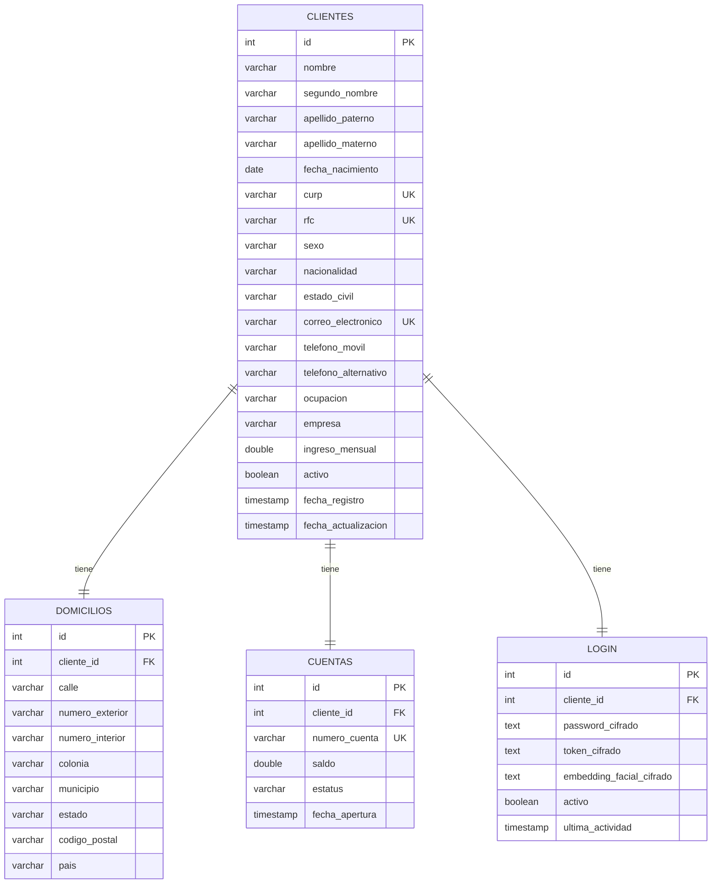

# Integración de Clientes API — Onboarding de Clientes Personas Físicas

## Objetivo
Registrar clientes personas físicas, validar su información, crear automáticamente una
cuenta bancaria con saldo inicial, y proteger el acceso mediante login con contraseña y/o
reconocimiento facial, todo cifrado en base de datos.

## Diagrama entidad-relación

## Script de creación de base de datos
`src/main/resources/db/migration/V3__create_clientes_schema.sql` — aplicado automáticamente
por Flyway al arrancar la aplicación. Renombra la tabla original `personas` a `clientes`,
agrega todos los campos nuevos, y crea `domicilios`, `cuentas` y `login` con sus llaves
foráneas, restricciones únicas e índices.

## Decisiones técnicas

**Tipos de dato — lo más ligero posible:**
- `ingreso_mensual`, `saldo` → `double` (no `decimal`, para no cargar memoria extra en un
  proyecto académico sin necesidad de precisión bancaria estricta).
- `codigo_postal` → `VARCHAR(5)`, **no `int`** — un CP puede empezar en 0 y un entero
  perdería ese dígito.
- Password, token y embedding facial → `TEXT` (más ligero que `VARCHAR` con longitud fija,
  ya que el contenido cifrado varía en tamaño).

**Cifrado (AES, vía `spring-security-crypto`):**
Password, token de sesión y el vector de embedding facial se cifran con
`TextEncryptor` (AES) antes de guardarse — nunca se persiste texto plano. La clave y el
salt se inyectan por variables de entorno (`APP_ENCRYPTION_PASSWORD`,
`APP_ENCRYPTION_SALT`), nunca hardcodeadas.

**Reconocimiento facial — sin procesar imágenes en el backend:**
MediaPipe Face Detection/Embedding no tiene SDK maduro para Java/Spring Boot. El backend
nunca recibe ni procesa imágenes: el cliente (navegador/app) captura el rostro y genera el
vector de embedding (con MediaPipe o `face-api.js`, ambos gratuitos), y solo envía ese
vector numérico. El backend lo cifra, lo guarda, y para verificar login compara distancia
euclidiana entre el vector guardado y el recibido (umbral configurado en
`LoginServiceImpl.UMBRAL_DISTANCIA_FACIAL`).

**Sesión activa con apagado automático:**
Al iniciar sesión (`activarSesion`), `Login.activo=true` y se registra `ultimaActividad`.
Un job programado (`@Scheduled(fixedRate = 60000)`) revisa cada minuto todas las sesiones
activas y apaga (`activo=false`) las que llevan más de 5 minutos sin actividad
(`PUT /login/actividad/{clienteId}` se debe llamar en cada request autenticado del
frontend para "refrescar" la sesión).

**Reglas de negocio implementadas:**
- Mayoría de edad (18 años) validada con `Period.between` antes de crear el cliente.
- CURP, RFC y correo únicos — verificados contra la BD antes de insertar.
- CURP, RFC y número de cuenta **nunca** se pueden modificar (el DTO de actualización ni
  siquiera tiene esos campos).
- Cuenta creada automáticamente con saldo inicial 0 y estatus `ACTIVA`, número de cuenta
  único generado con timestamp + UUID.
- Baja lógica: desactiva cliente y cuenta sin borrar filas de la BD.

**Todo en Postgres, nada en Redis:** Cliente, Domicilio, Cuenta y Login son JPA
repositories normales contra Postgres — completamente independientes del módulo de cache
de Redis usado por GestoPago.

## Endpoints implementados

| Método | Ruta | Descripción |
|---|---|---|
| POST | `/clientes` | Registra cliente + domicilio + cuenta automática |
| GET | `/clientes` | Lista todos los clientes |
| GET | `/clientes/{id}` | Cliente por id |
| GET | `/clientes/curp/{curp}` | Cliente por CURP |
| GET | `/clientes/rfc/{rfc}` | Cliente por RFC |
| GET | `/clientes/activos` | Solo clientes activos |
| GET | `/clientes/rango-fechas?desde=&hasta=` | Clientes registrados en un rango de fechas |
| PUT | `/clientes/{id}` | Actualiza datos (sin CURP/RFC) |
| DELETE | `/clientes/{id}` | Baja lógica |
| GET | `/cuentas/{numeroCuenta}` | Cuenta por número |
| GET | `/cuentas/activas` | Cuentas activas |
| GET | `/cuentas/{numeroCuenta}/saldo` | Saldo de una cuenta |
| POST | `/login/registrar` | Registra password/embedding facial (cifrados) |
| POST | `/login/iniciar-sesion` | Login con password |
| POST | `/login/iniciar-sesion-facial` | Login con reconocimiento facial |
| POST | `/login/cerrar-sesion/{clienteId}` | Cierra sesión manualmente |
| PUT | `/login/actividad/{clienteId}` | Refresca la sesión (evita el apagado a 5 min) |

## Manejo de excepciones personalizadas
`ClienteNoEncontradoException`, `CurpDuplicadaException`, `RfcDuplicadoException`,
`CorreoDuplicadoException`, `ClienteYaRegistradoException`, `CuentaNoEncontradaException`,
`ValidacionNegocioException`, `CredencialesInvalidasException`, `LoginNoEncontradoException`
— todas manejadas centralmente en `GlobalExceptionHandler`, devolviendo el HTTP correcto
(404/409/400/401) y un mensaje claro, nunca un error genérico.

## Evidencia de pruebas
`ClienteServiceImplTest` cubre: creación exitosa con cuenta automática, rechazo por
menor de edad, CURP/RFC/correo duplicados, cliente no encontrado, y baja lógica
(desactiva cliente y cuenta). Todas las pruebas pasan (`BUILD SUCCESSFUL`).